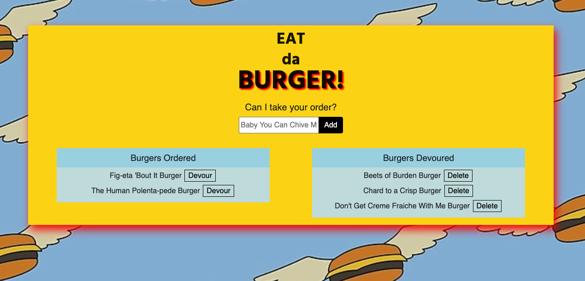

# Homework 13: Eat-da-Burger! Node-Express-Handlebars Application


    
## Table of Contents
* [Description](#description)
* [Installation](#installation)
* [Usage](#usage)
* [Tests](#test)
* [Questions](#questions)
* [Contributing Authors](#contributors)
* [License](#license)
    
# Description
A burger logger with MySQL, Node, Express, Handlebars and a homemade ORM (yum!). Follows the MVC design pattern; uses Node and MySQL to query and route data, and Handlebars to generate  HTML.

* <a href="https://pure-lake-63894.herokuapp.com/">Link to Deployed App on Heroku.</a>


    
## Installation
To use application from your local environment, you must accomplish the following steps below:

**Step 1 - Clone my repo using the command line below.**
```
git clone git@github.com:cascutter/Node-Express-Handlebars-HW13.git
```
**Step 2 - Change directory to the cloned repo folder.**
```
cd Node-Express-Handlebars-HW13
```
**Step 3 - Install all required NPM packages.**
```
npm install
```
**Step 4 - Start the application server using the command line below**
```
node server.js
```
    
## Usage
The application allows users to accomplish the following tasks:
* Eat-Da-Burger! is a restaurant app that lets users input the names of burgers they'd like to eat.

* Whenever a user submits a burger's name, the app will display the burger on the left side of the page -- waiting to be devoured.

* Each burger in the waiting area also has a `Devour` button. When the user clicks it, the burger will move to the right side of the page.

* Once the burger displays in the Devoured column, the user can delete the burger from the database.

* The app will store every burger in a database, whether devoured or not.


          
## Tests
All tests currently passing.

## Future Development
* This is a slow-moving app. Would like to spend more time focusing on refactoring for efficiency.
            
## Questions
All questions regarding this application can be directed to: 
 
<a href="https://github.com/cascutter">cascutter</a> 

<a href="mailto:cascutter13@gmail.com">cascutter13@gmail.com</a>
    
# Contributing Authors
* Casandra Cutter 
    
# License
MIT License